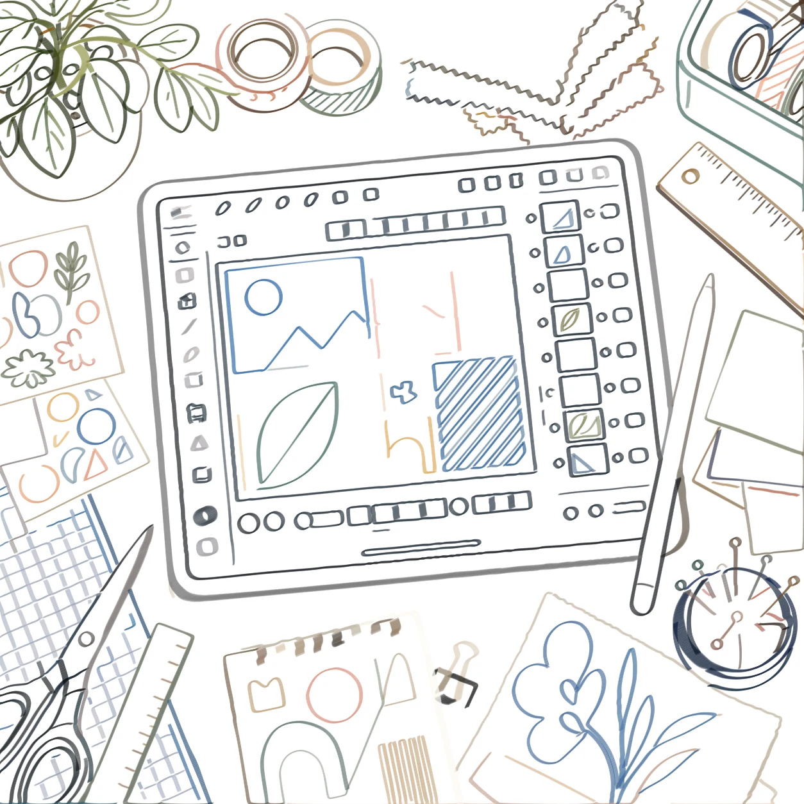
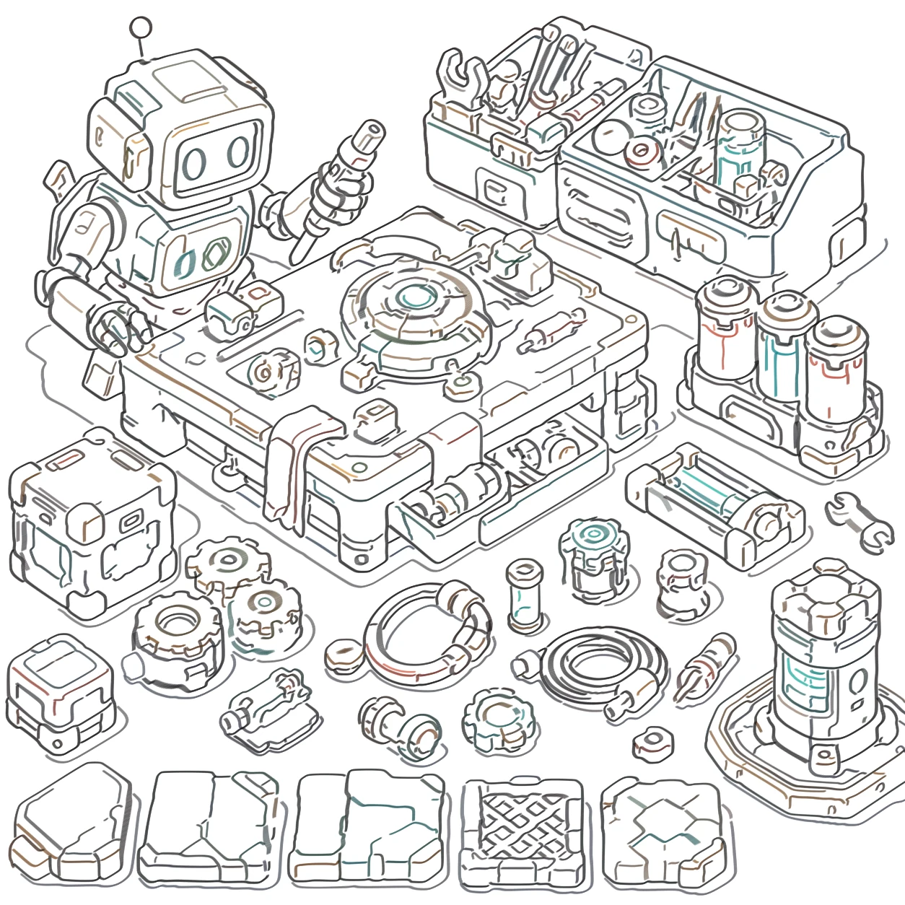
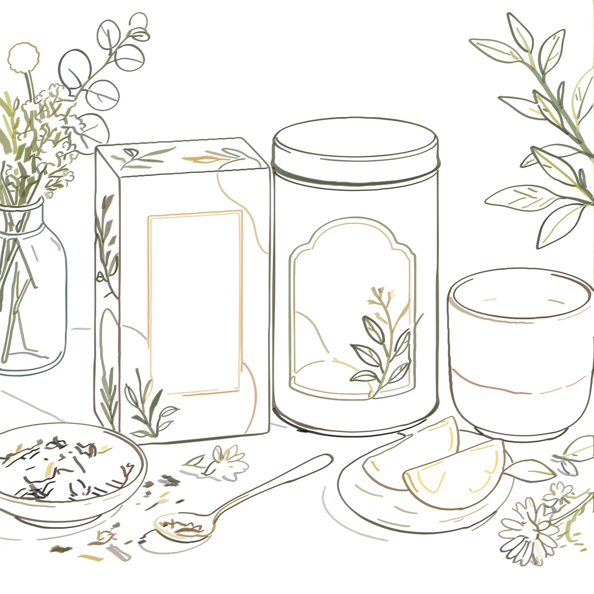
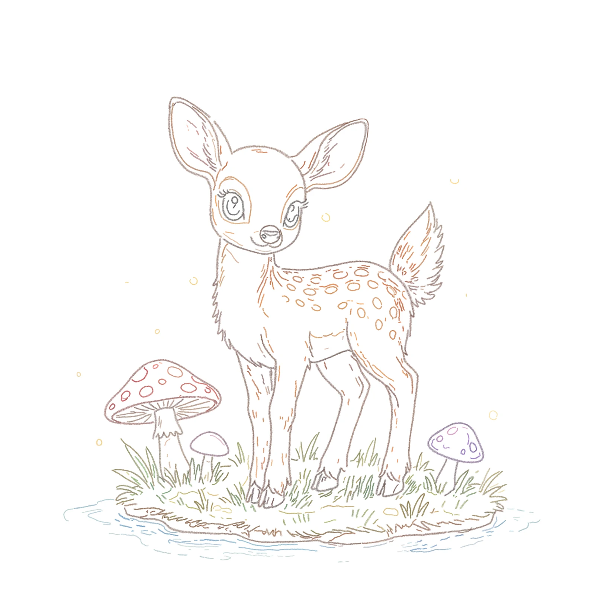
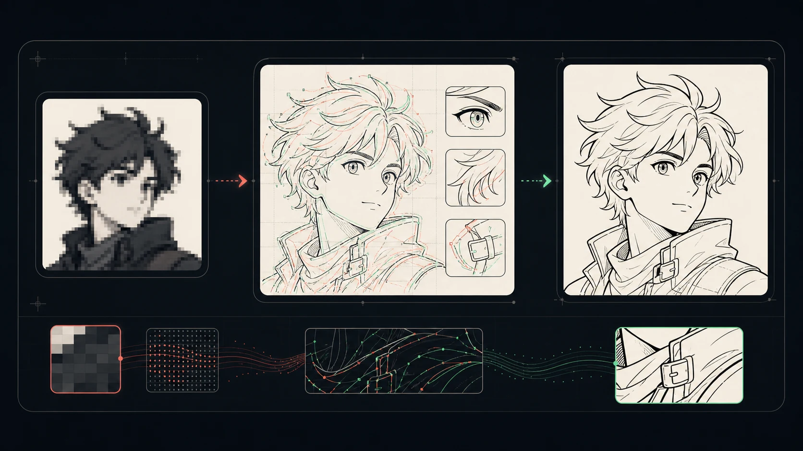
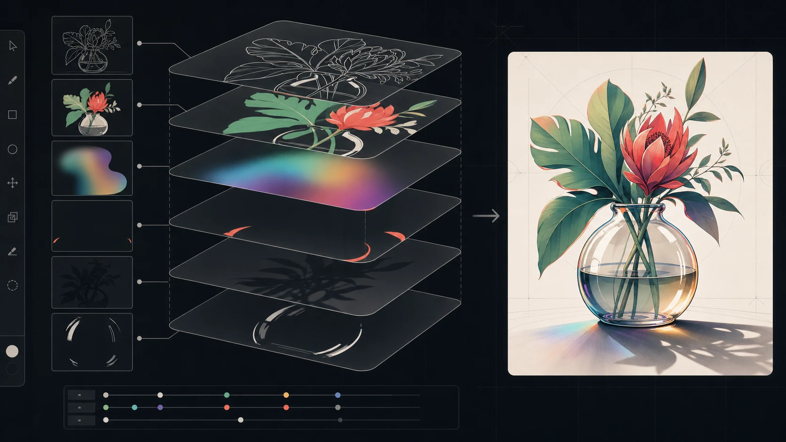
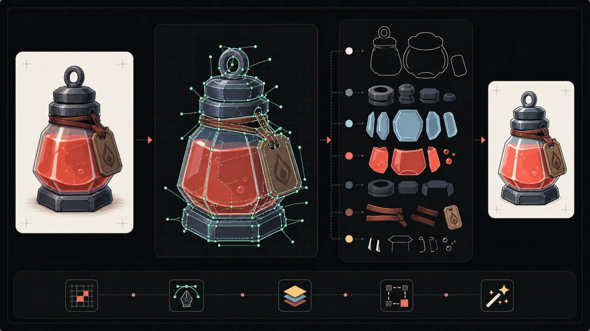

<h1 align="center">NeuBE Line Repaint</h1>

  Re-render image material as clean, inspectable line trajectories.

  <a href="https://neubeart.com/"><strong>Official Website</strong></a>
  ·
  <a href="https://cn.neubeart.com/"><strong>中文官网</strong></a>
  ·
  <a href="https://github.com/polarlynx/neube-line-repaint/issues"><strong>Issues</strong></a>

  
  

NeuBE Line Repaint is a desktop creative tool that reconstructs sketches, AI concepts, screenshots, renders, backgrounds, and commercial art as cleaner line trajectories. Instead of simply exposing source-image edges, it re-renders the visible structure into a more coherent result that artists can inspect, edit, composite, and hand off.

This repository is a public project page. The application source code is not included here.

## Visual Results

### Design Workspace

<table>
  <tr>
    <td width="50%"></td>
    <td width="50%"></td>
  </tr>
  <tr>
    <td align="center"><strong>Source image</strong></td>
    <td align="center"><strong>Re-rendered result</strong></td>
  </tr>
</table>

### Game Prop Sheet

<table>
  <tr>
    <td width="50%"></td>
    <td width="50%"></td>
  </tr>
  <tr>
    <td align="center"><strong>Source image</strong></td>
    <td align="center"><strong>Re-rendered result</strong></td>
  </tr>
</table>

### Commercial And Illustration Material

<table>
  <tr>
    <td width="25%"></td>
    <td width="25%"></td>
    <td width="25%"></td>
    <td width="25%"></td>
  </tr>
  <tr>
    <td align="center">Packaging source</td>
    <td align="center">Re-rendered result</td>
    <td align="center">Illustration source</td>
    <td align="center">Re-rendered result</td>
  </tr>
</table>

## What It Focuses On

- **Re-rendered line trajectories** that reconstruct visible structure instead of merely tracing source-image edges.
- **Readable structure** for characters, props, interiors, UI-like scenes, packaging, and textured illustration.
- **Editable handoff direction** for PNG and PSD-style workflows.
- **Noise reduction** around soft, painterly, or uneven source edges.
- **Local-first workflow** shaped like a desktop art tool.

## Ongoing Development

NeuBE will keep improving around real creative work—not metered cloud usage.

- **Next priorities:** a more natural drawing feel, stronger sketch repainting, more useful color extraction, and the workflow details surfaced by real projects.
- **Shaped by feedback:** feature requests, edge cases, and production feedback shared in [GitHub Issues](https://github.com/polarlynx/neube-line-repaint/issues) help set the direction of each update.
- **Updates beyond the license:** the drawing workspace and bundled local Stable Diffusion tools continue to receive updates without an active license.
- **No usage economy:** beyond the license you choose, there are no generation credits, usage packs, or second subscription layer.
- **Local-first by design:** creative work and processing stay on your machine.

### R&D Concept Previews — In Development

> The following concept visuals communicate active R&D directions. They are not features in the current release and do not promise a specific release date.

#### Stronger Low-Resolution Recovery

Improve structural recovery and line clarity when the source image is small, soft, or visibly pixelated.

  

#### Advanced Color Separation

Explore editable separation for gradients, hidden accent colors, multiply shading, and richer color relationships.

  

#### Editing-Friendly Vector Conversion

Explore converting raster artwork into editing-friendly vector paths, shapes, and logical object groups.

  

## PSD-Oriented Output

  

NeuBE Line Repaint is designed around re-rendered trajectories that can keep moving through a production pipeline. The goal is not just a preview image, but a cleaner editable layer that can be checked, adjusted, composited, and handed off.

## Good Fits

- AI concept art that needs cleaner line structure.
- Commercial art and packaging concepts.
- Prop sheets and game asset workbenches.
- Backgrounds and interior scenes with readable perspective.
- Screenshot-like design scenes with panels, tools, and small details.

## Known Limits

Very soft painterly sources, dense exterior street scenes, and ambiguous texture edges can still require manual review or cleanup. The best results come from source images where the main shapes and details are visually readable.
