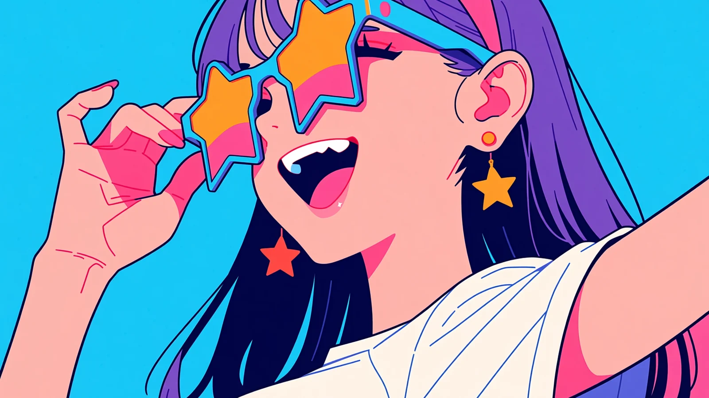
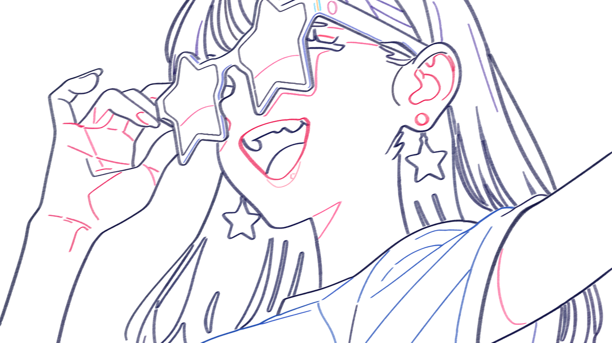
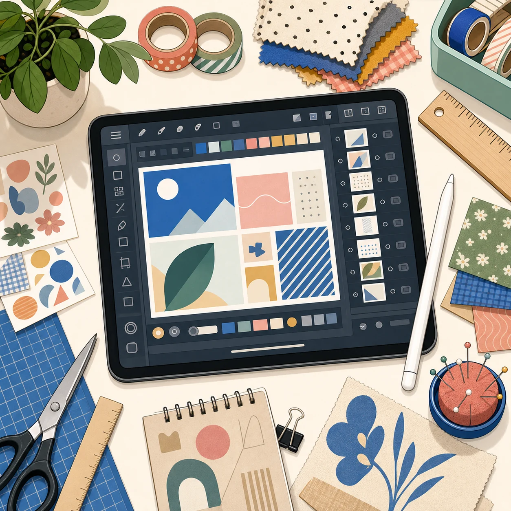
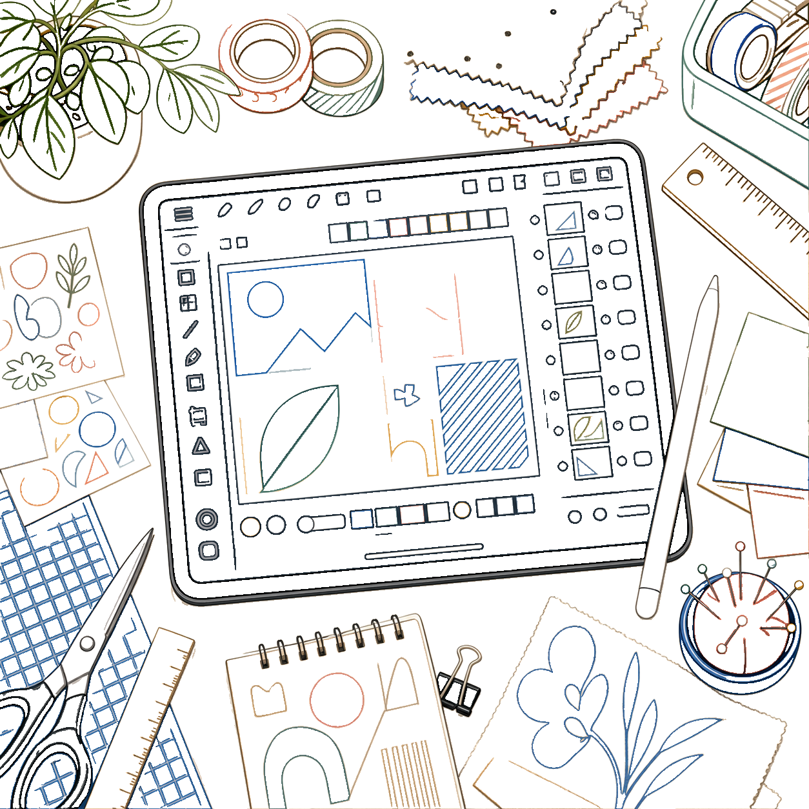
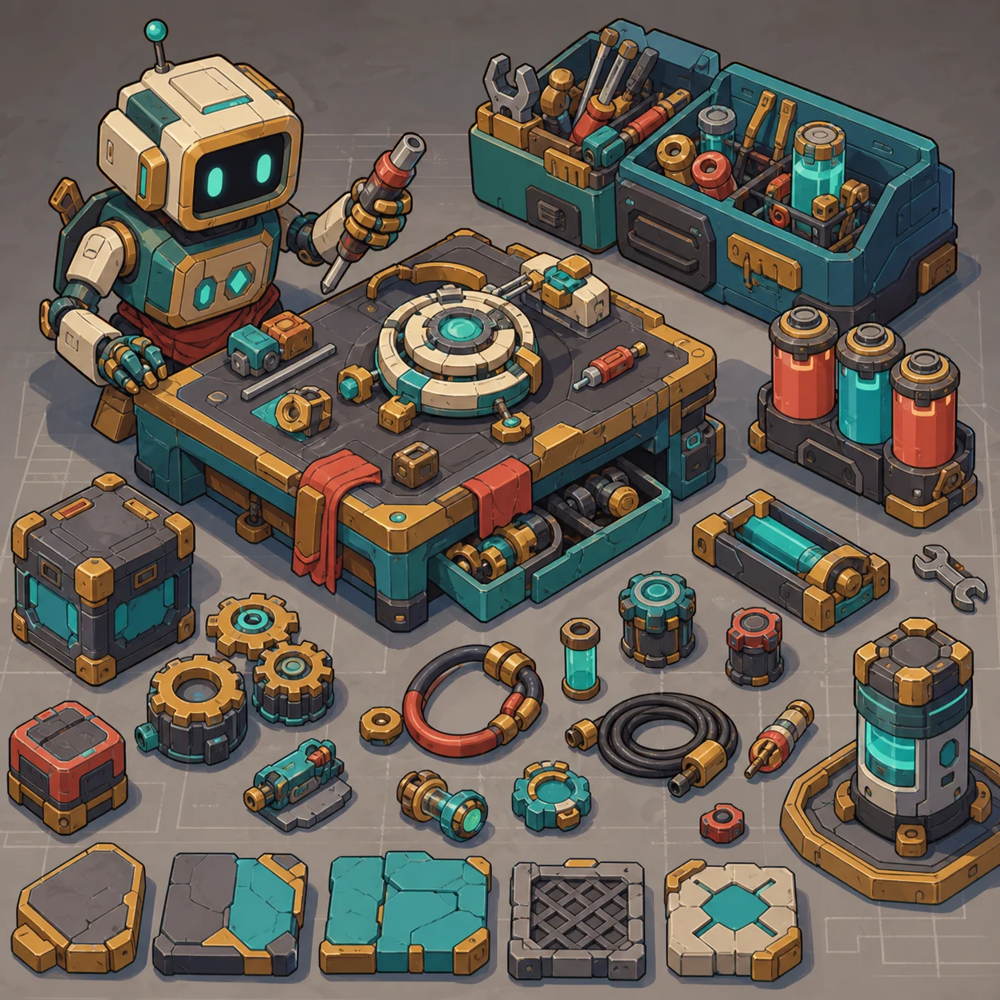
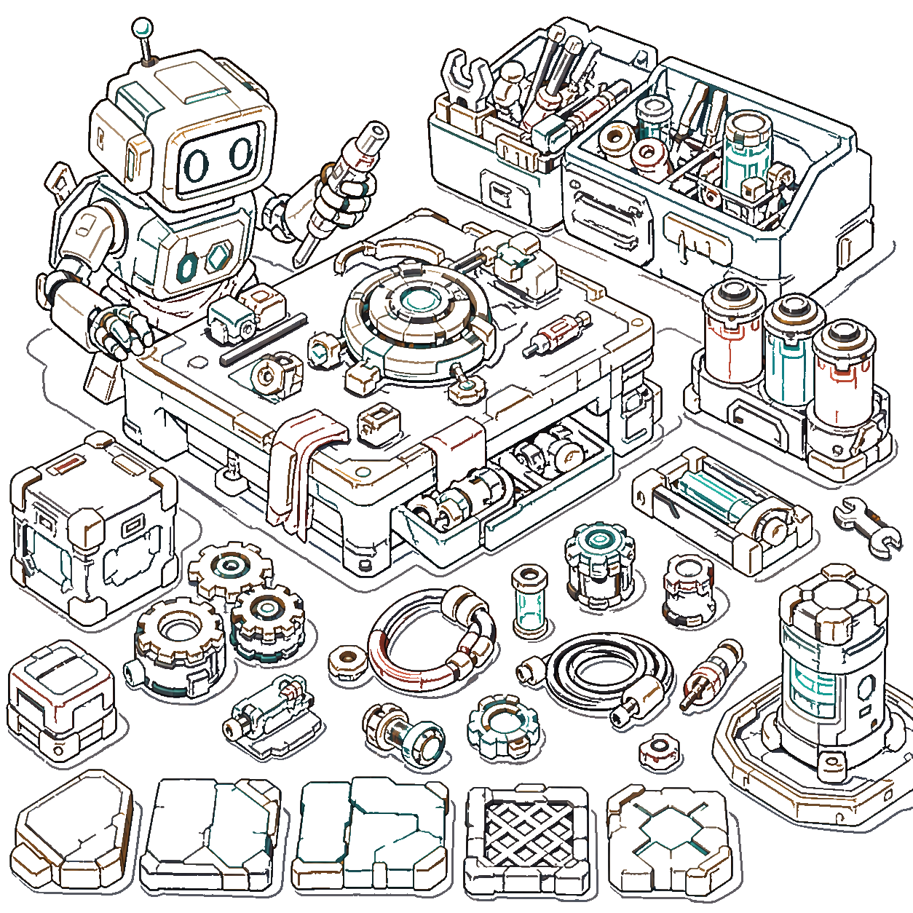
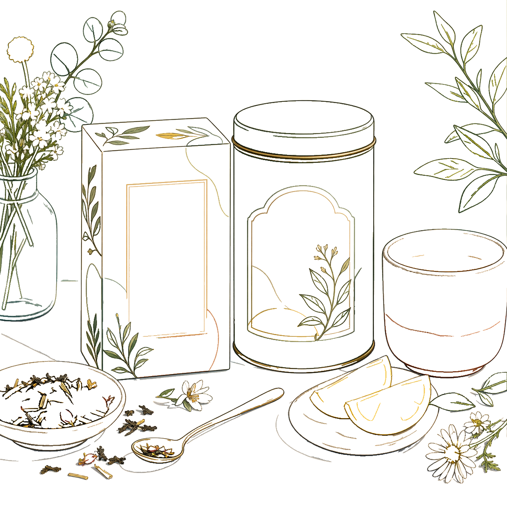
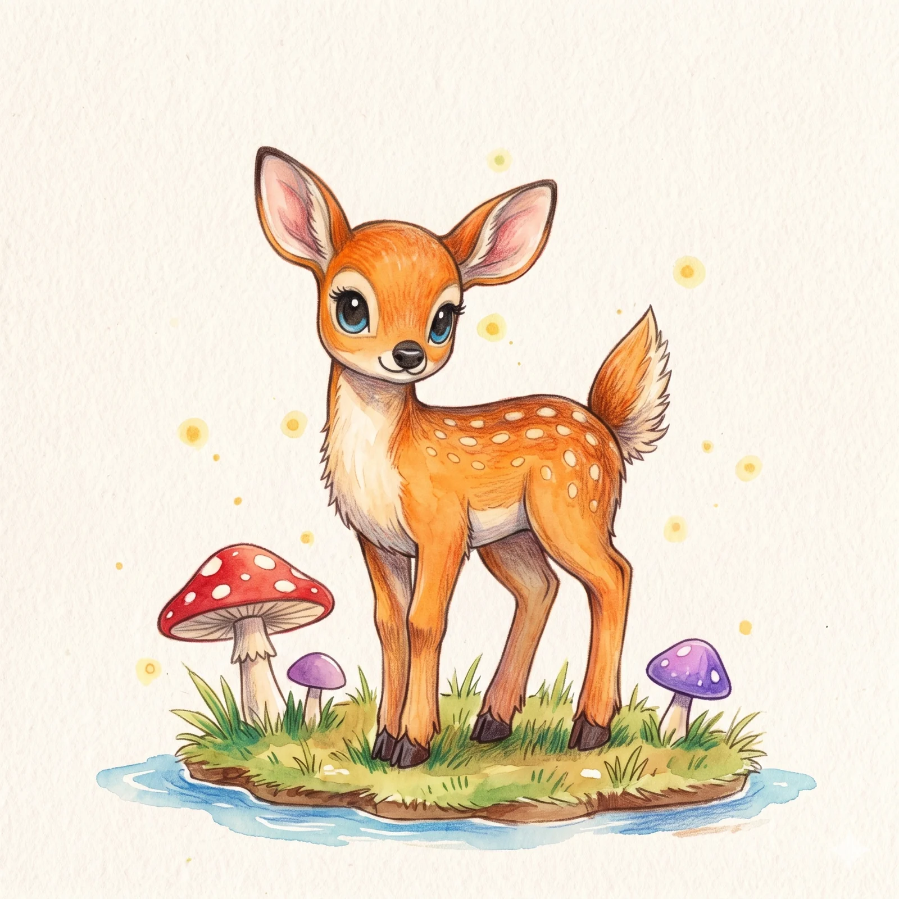
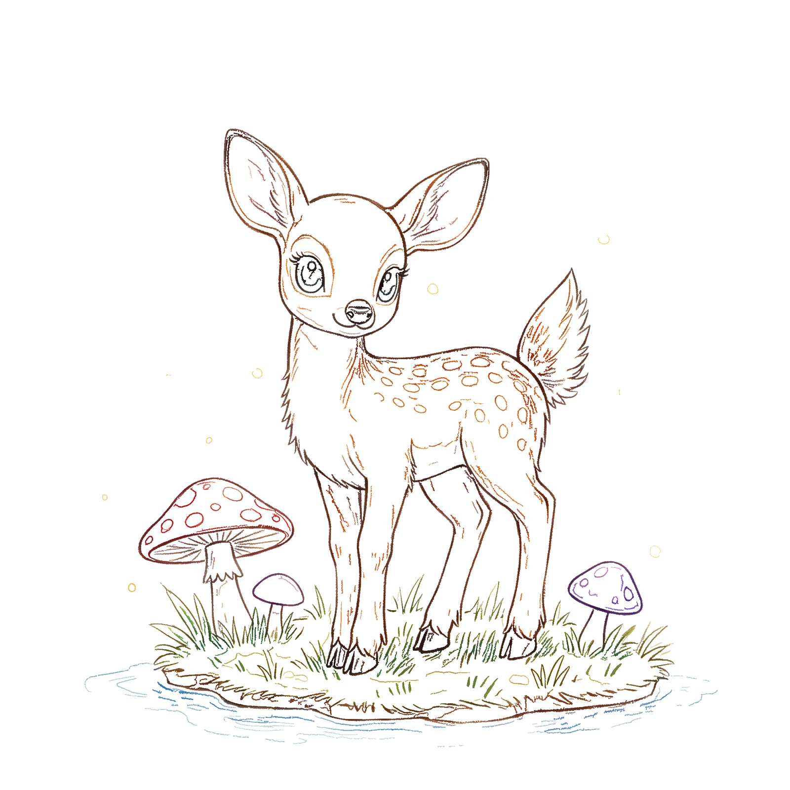
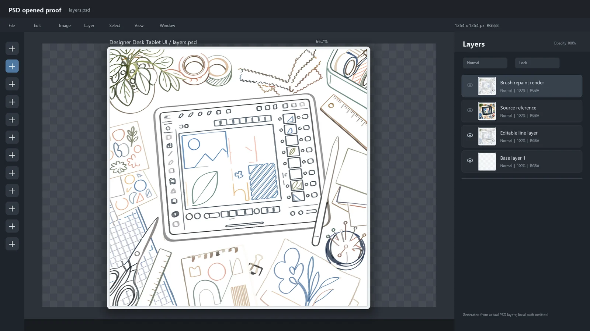

# NeuBE Line Repaint

  <a href="README.md"><strong>English / 双语主页</strong></a>
  ·
  <a href="https://github.com/polarlynx/neube-line-repaint/issues"><strong>Issues</strong></a>

  
  

NeuBE Line Repaint 是一款桌面创作工具，用于把草图、AI 概念图、截图、渲染图、背景、包装概念图和商业美术素材转成更干净的生产线稿。它关注的不是简单滤镜效果，而是能继续编辑、检查、合成和交付的线稿层。

这个仓库是公开项目页，不包含应用源码。

## 效果展示

### 设计工作台场景

<table>
  <tr>
    <td width="50%"></td>
    <td width="50%"></td>
  </tr>
  <tr>
    <td align="center"><strong>原始图像</strong></td>
    <td align="center"><strong>NeuBE 线稿</strong></td>
  </tr>
</table>

### 游戏道具表

<table>
  <tr>
    <td width="50%"></td>
    <td width="50%"></td>
  </tr>
  <tr>
    <td align="center"><strong>原始图像</strong></td>
    <td align="center"><strong>NeuBE 线稿</strong></td>
  </tr>
</table>

### 商业素材与插画素材

<table>
  <tr>
    <td width="25%"></td>
    <td width="25%"></td>
    <td width="25%"></td>
    <td width="25%"></td>
  </tr>
  <tr>
    <td align="center">包装原图</td>
    <td align="center">包装线稿</td>
    <td align="center">插画原图</td>
    <td align="center">插画线稿</td>
  </tr>
</table>

## 功能重点

- **从图像素材生成生产线稿**，不局限于手绘草图。
- **保留可读结构**，适合角色、道具、室内背景、类 UI 场景、包装和纹理插画。
- **面向可编辑交付**，围绕 PNG 和 PSD 风格工作流设计。
- **减少边缘噪声**，改善柔和、绘画感或不稳定边缘带来的线稿问题。
- **本地优先创作流程**，更像桌面美术工具，而不是网页滤镜服务。

## 面向 PSD 的输出方向

  

NeuBE Line Repaint 的目标不是只生成一张预览图，而是产出能继续进入生产流程的线稿层：可以检查、编辑、合成和交接。

## 适合的素材类型

- 需要整理线条结构的 AI 概念图。
- 商业美术和包装概念图。
- 道具表、游戏资产工作台。
- 有明确透视和结构的背景、室内场景。
- 包含面板、工具、小元素的类截图设计场景。

## 已知边界

非常柔和的绘画素材、密集街景、边缘含糊的纹理图，仍可能需要人工复核和整理。主形体与细节越清晰，线稿结果通常越稳定。
